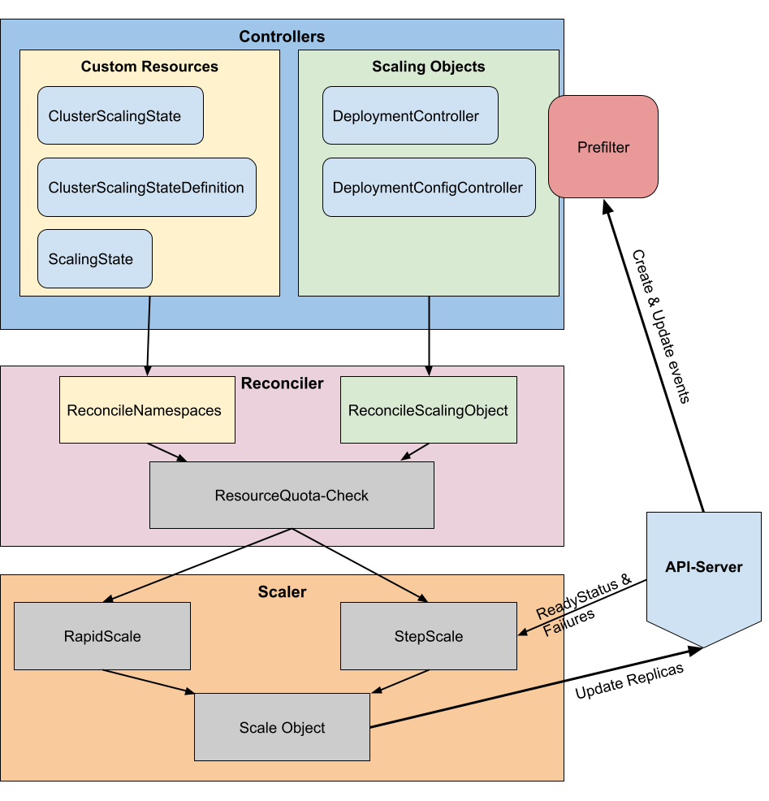
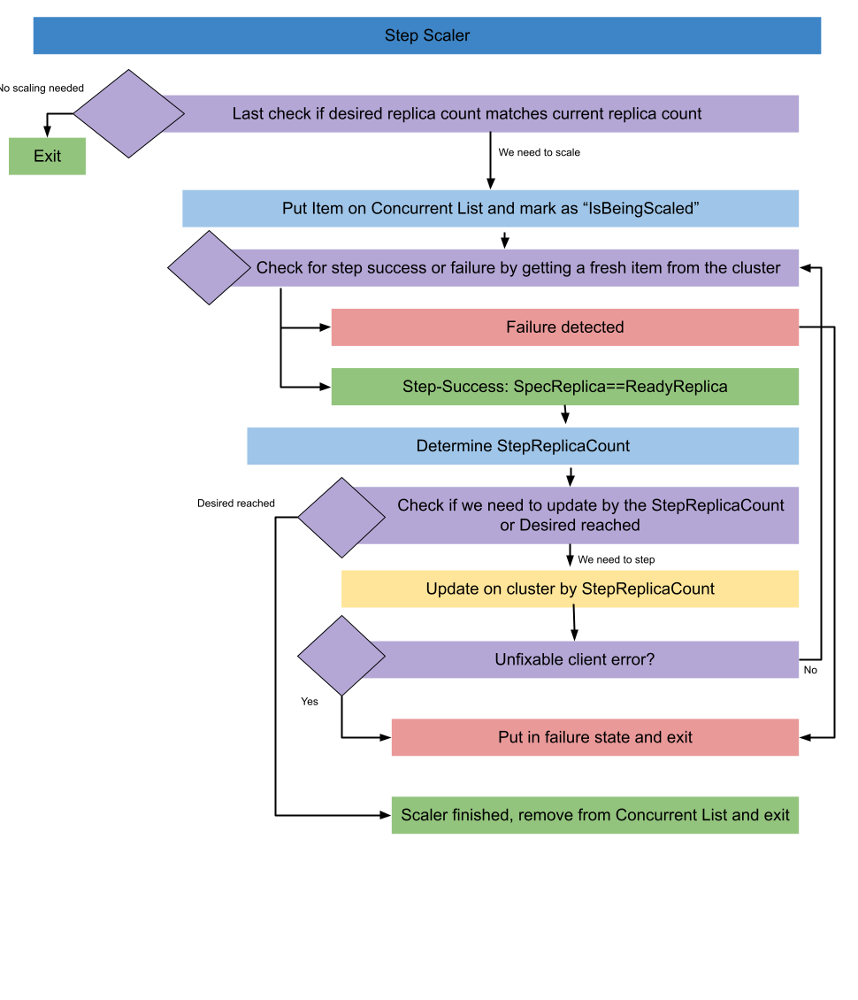

# Architeture Overview
Below you can see a rough overview of the components of the PreScaling Operator:

# Controllers

The Controllers play a fundamental role in the operator. They decide when a reconciliation loop is being triggered. With the operator framework SDK we can watch certain resources and control their behaviour when they’re triggered. Furthermore we’re able to add Prefilters to make further decisions on whether the Operator should react to a change on an object.

The main task of the controllers is to gather the current states of necessary resources and then pass it to the Reconciler for further decision making and reconciliation.

# Custom Resources

Our Custom Resources are either Cluster-wide (ClusterScalingState & ClusterScalingStateDefinition) or Namespaced (ScalingState).

Once there is an update or creation on any of these resources the operator is triggered.

# Prefilter

A prefilter can make decisions if a change on an object should be reconciled or not. So instead of triggering the corresponding controller for every event, we check before in the Prefilter if the controller and reconciliation for the event should be triggered or not.

Currently we have a single Prefilter registered on Deployment and DeploymentConfig resources. For any **create** or **update** event on these Resources the prefilter is triggered. The decisions the Prefilter is making are as follows:

<table>
  <tr>
   <td><strong>Check</strong>
   </td>
   <td><strong>Result</strong>
   </td>
  </tr>
  <tr>
   <td>The object has just opted in*
   </td>
   <td>true
   </td>
  </tr>
  <tr>
   <td>There is a change to the annotation containing the replicas
   </td>
   <td>true
   </td>
  </tr>
  <tr>
   <td>There is a change to the <em>spec.replica</em> count**
   </td>
   <td>true
   </td>
  </tr>
  <tr>
   <td>The object is  already being scaled at the moment
   </td>
   <td>false
   </td>
  </tr>
  <tr>
   <td>The object is in failure state***
   </td>
   <td>false
   </td>
  </tr>
</table>

 

* |* If the object is **not** opted-in, all other conditions don’t matter. The Prefilter will return false and no reconciliation will happen.
* |** The operator will change it **back** according to the state. To prevent this from happening at all we have an optional **admission controller**

* |*** Only the scheduled _reconciler_cron_ is able to reconcile on Objects in failure state and can resolve them.

 

# Quota Check

Before the operator will scale an object the operator will perform a **Quota Check**. The operator will calculate if the desired replica count **would** violate the present Resource Quotas in a namespace. If it does, the operator won’t scale at all and log with appropriate logging messages and events. 

The ResourceQuota check will only be done if there are ResourceQuotas present in a namespace and Resource Limits present on the Objects.

 

# ReconcileNamespace vs ReconcileScalingItem

There are two different paths of Reconciliation in the operator: ReconcileNamespace and ReconcileScalingItem. ReconcileNamespace is able to Reconcile all opted-in ScalingItems within that namespace while ReconcileScalingItem is only acting upon one opted-in ScalingItem.

**Triggers of ReconcileNamespace:**

<table>
  <tr>
   <td><strong>Controller</strong>
   </td>
   <td><strong>Purpose</strong>
   </td>
  </tr>
  <tr>
   <td>ClusterScalingStateDefinitionController
   </td>
   <td>Trigger upon changes to ClusterScalingStateDefinition CR. Will Reconcile all namespaces where there are opted in ScalingItems.
   </td>
  </tr>
  <tr>
   <td>ClusterScalingStateController
   </td>
   <td>Trigger upon changes to ClusterScalingState CR. Will Reconcile all namespaces where there are opted in ScalingItems
   </td>
  </tr>
  <tr>
   <td>ScalingStateController
   </td>
   <td>Will Reconcile the namespace the ScalingState CR belongs to.
   </td>
  </tr>
</table>

 
 

**Triggers of ReconcileScalingItem:**  
These are subject to the **prefilter** as well. 

 

<table>
  <tr>
   <td><strong>Controller</strong>
   </td>
   <td><strong>Purpose</strong>
   </td>
  </tr>
  <tr>
   <td>DeploymentWatchController
   </td>
   <td>Triggered upon changes to Deployments. 
   </td>
  </tr>
  <tr>
   <td>DeploymentConfigWatchController
   </td>
   <td>Triggered upon changes to DeploymentConfigs. 
   </td>
  </tr>
</table>

 

# Scaling Items and the Concurrent List

Currently we support two “Scaling Items”. Deployments & DeploymentConfigs. Support for other resources like ReplicaSets & StatefulSets is planned in the future.

We coined the term “Scaling Item” to create an interface for the operator to work on. Therefore we convert Deployment and DeploymentConfigs to a “ScalingItem” that contains all the necessary information for the operator which are then being passed from the controller to the reconciler and finally to the scaler. The operator can put information on that Item that is important to make decisions for the scaler. One example is writing failure(messages) on that Item in order to handle them later. 
 

**The Concurrent List**

The main purpose of the List is to share information between multiple reconciles happening at the same time. For example:

When an Object is being step scaled, an update on a ClusterScalingState may trigger another reconciliation at the same time. When the update also changes the ScalingState (and therefore desired replicas) for the object that is being scaled, we can update that item on the list which then the step scaler is able to take into account. This prevents that multiple scalers can be active at the same time on the same item, while still being able to take changes into account.

The ConcurrentList is equipped with a MUTEX and is therefore Thread-Safe. \
Only the (Step)Scaler is able to add or remove items to the list. An item is only removed (and therefore forgotten) once the item has reached its desired replica count. When a item is failing on the cluster while it is being scaled it will be put in failure state and kept in the list so the operator can come back to it later.

The list is not persisted, so when the operator crashes and/or restarts it’ll lose the information in the list. However when the operator starts it’ll detect all opted in ScalingItems that are not at the desired replica count yet, and will try to scale them. Therefore the list is filled again and the operator can continue. This also includes ScalingItems that are in a failing state. \

 

# Failure Handling

Failures upon scaling are a special case that the operator is able to handle. The Operator is checking if an update has worked correctly. If it doesn’t (usually after a timeout of _spec.ProgressDeadlineExceeded)_ we put the ScalingItem in **failure state **and keep it in the Concurrent List. In most cases the causing issue (for example a wrong image tag) has to be resolved by an admin on the cluster. Once the issue is resolved and kubernetes is trying to get to _spec.replicas_ again, the operator kicks in every minute on a schedule and tries to rectify all ScalingItems that are in failure state. Once the desired replica count is reached the ScalingItem is removed from the failure state and Concurrent List, and the failure handling is complete.

If a failing ScalingItem is deleted on the cluster the operator will forget about it as well.

 

# StepScaler

The main way to scale a ScalingItem is by the StepScaler. There is an alternative to “Rapid scale” which can be set on the ClusterScalingStateDefinition. \
Step Scaling is done one by one. Between each scaling step the StepScaler is checking if the StepReplicaCount matches the ReadyReplicas. If the ProgressDeadlineExceeded (The deployment or deploymentconfig didn’t get the Replicas Ready in time) we put the object in failure mode. Step scaling can be enabled with setting _config.rateLimiting: true _on the ClusterScalingStateDefinition.

Below is an illustration of the StepScaler algorithm:

Step Scaling is enabled by default. It can disabled with `"scaler/rapid-scaling": "true"`, which opts to the Rapid Scaler.
 

# Rapid Scaler

As the name already suggests, the rapid scaler changes the replica immediately to the desired replica count without intermediate steps. The rapid scaler also doesn’t wait for the ReadyReplicas to be ready, it simply changes the spec.replica field and terminates right after. This might be changed later on, to reflect the behaviour of the step scaler.

Rapid scaling can be enabled on each individual Deployment/DeploymentConfig with setting an annotation with `"scaler/rapid-scaling": "true"`. 
 

  

**Events and logging**

The Operator is logging events on three different levels:

1. On Custom Resources
    * Changes to the Resources and informations about the new states
2. On Namespaces
    * Events on the namespace like ResourceQuota violation
3. On Deployments and DeploymentConfigs
    * To register successful and unsuccessfull scaling events.

